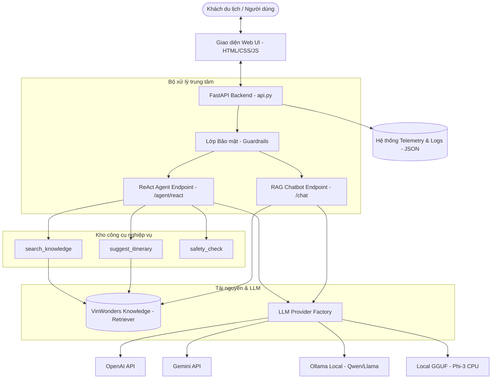

# 🗺️ Hướng Dẫn Chạy & Đánh Giá Lab 3: Chatbot vs ReAct Agent
> **Dự án: Trợ lý Du lịch Ảo VinWonders Việt Nam (Virtual Travel Guide)**
>
> Tài liệu này được thiết kế chi tiết giúp **Giảng viên** dễ dàng nắm bắt kiến trúc hệ thống, kiểm tra mã nguồn, chạy thử nghiệm ứng dụng và đánh giá kết quả thực hành một cách nhanh chóng và trực quan nhất.

---

## 📸 Tổng Quan Hệ Thống (System Overview)

Dự án này mô phỏng một hệ thống **Hỗ trợ khách du lịch ảo cho hệ thống giải trí VinWonders Việt Nam** (Phú Quốc, Nha Trang, Nam Hội An). Hệ thống so sánh trực tiếp hiệu năng giữa hai hướng tiếp cận:
1. **RAG Chatbot Baseline**: Sử dụng kỹ thuật tìm kiếm tài liệu tương đồng và đưa vào ngữ cảnh LLM để sinh câu trả lời trực tiếp.
2. **ReAct Agent (Reasoning + Acting)**: Sử dụng mô hình suy luận vòng lặp `Thought -> Action -> Observation` để gọi các công cụ (tools) nghiệp vụ phù hợp, xử lý các truy vấn phức tạp hoặc yêu cầu bảo mật thông tin tốt hơn.

### 🌐 Sơ Đồ Kiến Trúc Hoạt Động (Architecture Flow)


---

## 🛠️ Cấu Trúc Thư Mục Dự Án (Directory Structure)

Giảng viên có thể tham khảo nhanh sơ đồ phân mục dưới đây để kiểm tra các phần code cốt lõi của sinh viên:

*   **`src/`**: Thư mục chứa toàn bộ mã nguồn backend.
    *   **`src/core/`**: Khởi tạo cấu trúc các LLM Provider (`Gemini`, `OpenAI`, `Ollama`, `Local GGUF`) kế thừa từ interface chung `LLMProvider` và `provider_factory.py` giúp đổi mô hình linh hoạt qua cấu hình môi trường.
    *   **`src/agent/`**: 
        *   `agent.py`: Chứa lõi thuật toán vòng lặp ReAct truyền thống (Thought-Action-Observation) và bộ phân tách Regex (Parser) để phát hiện hành động hoặc câu trả lời cuối cùng.
        *   `improved_agent.py` (V2 Agent): Tích hợp thêm lớp **Security Guardrails** chống Prompt Injection và cơ chế xử lý lỗi khi mô hình ảo tưởng (hallucinated) công cụ.
    *   **`src/tools/`**: Định nghĩa danh sách các công cụ nghiệp vụ của Agent như tra cứu thông tin điểm vui chơi, gợi ý lịch trình cá nhân hóa, kiểm tra lưu ý an toàn.
    *   **`src/rag/`**: Xử lý việc thu thập tài liệu điểm đến, tính toán điểm tương đồng (retriever) dựa trên tệp dữ liệu `vinwonders_knowledge.py` làm cơ sở tri thức cục bộ.
    *   **`src/security/`**: Chứa bộ quy tắc bảo mật chống jailbreak, ngăn chặn rò rỉ prompt hệ thống hoặc xuất toàn bộ cơ sở dữ liệu.
    *   **`src/telemetry/`**: Hệ thống logging giám sát thời gian phản hồi (latency), số lượng token sử dụng, vòng lặp suy luận và lưu trữ dưới dạng JSON tại thư mục `logs/`.
    *   **`src/evaluation/`**: Chứa mã nguồn tự động đánh giá từ khóa (keyword search hit) và tốc độ phản hồi của mô hình.
*   **`fe/`**: Giao diện người dùng Web Chatbot cao cấp (VinWonders V-Guide UI).
*   **`tests/`**: Các ca kiểm thử tự động (Unit Tests) chạy bằng thư viện `pytest`.
*   **`report/`**: Báo cáo nộp bài của sinh viên (gồm báo cáo nhóm `group_report/` và báo cáo cá nhân `individual_reports/`).

---

## 🚀 Hướng Dẫn Cài Đặt (Prerequisites & Installation)

Hệ thống hoạt động mượt mà trên môi trường **Windows** (sử dụng PowerShell hoặc CMD) cũng như macOS/Linux.

### Bước 1: Chuẩn bị Môi trường Python
1. Đảm bảo máy tính đã cài đặt **Python 3.10+**.
2. Di chuyển vào thư mục dự án và khởi tạo môi trường ảo (khuyên dùng):
   ```powershell
   # Tạo môi trường ảo python
   python -m venv .venv
   
   # Kích hoạt trên Windows (PowerShell)
   .venv\Scripts\Activate.ps1
   # HOẶC kích hoạt trên Windows (CMD)
   .venv\Scripts\activate.bat
   ```

### Bước 2: Cài đặt các Thư viện Phụ thuộc
Cài đặt toàn bộ dependencies cần thiết từ file `requirements.txt`:
```bash
pip install -r requirements.txt
```
> [!NOTE]
> Thư viện `llama-cpp-python` được cài đặt phục vụ cho việc chạy mô hình định dạng `.gguf` trực tiếp trên CPU của máy không có card màn hình (GPU).

---

## 🔑 Thiết Lập Cấu Hình Môi Trường (`.env`)

Giảng viên tạo một tệp tin tên `.env` ở thư mục gốc của dự án bằng cách sao chép từ mẫu `.env.example`:
```powershell
copy .env.example .env
```

Nội dung cấu hình trong `.env` hỗ trợ linh hoạt 4 loại nguồn cấp mô hình (Providers). Giảng viên có thể cấu hình theo các cách sau tùy thuộc tài nguyên có sẵn:

### Lựa chọn A: Sử dụng Google Gemini (Khuyên dùng - Dễ thiết lập nhất)
```env
DEFAULT_PROVIDER=google
DEFAULT_MODEL=gemini-1.5-flash
GEMINI_API_KEY=AIzaSy...[Điền API Key Gemini của Thầy/Cô tại đây]
```

### Lựa chọn B: Sử dụng OpenAI
```env
DEFAULT_PROVIDER=openai
DEFAULT_MODEL=gpt-4o-mini
OPENAI_API_KEY=sk-...[Điền API Key OpenAI của Thầy/Cô tại đây]
```

### Lựa chọn C: Sử dụng Ollama (Chạy Offline 100% bằng GPU/CPU cục bộ)
1. Tải và cài đặt [Ollama](https://ollama.com).
2. Tải mô hình nhỏ gọn hiệu năng cao (ví dụ: `qwen2.5:3b` hoặc `llama3`):
   ```bash
   ollama pull qwen2.5:3b
   ```
3. Cấu hình `.env`:
   ```env
   DEFAULT_PROVIDER=ollama
   DEFAULT_MODEL=qwen2.5:3b
   OLLAMA_BASE_URL=http://localhost:11434
   ```

### Lựa chọn D: Chạy trực tiếp file GGUF nội bộ (Không cần cài phần mềm ngoài)
1. Tải file mô hình [Phi-3-mini-4k-instruct-q4.gguf](https://huggingface.co/microsoft/Phi-3-mini-4k-instruct-gguf/resolve/main/Phi-3-mini-4k-instruct-q4.gguf) (~2.2GB).
2. Tạo thư mục `models/` tại gốc dự án và đặt file vừa tải vào đó.
3. Cấu hình `.env`:
   ```env
   DEFAULT_PROVIDER=local
   LOCAL_MODEL_PATH=./models/Phi-3-mini-4k-instruct-q4.gguf
   ```

---

## 🏃‍♂️ Hướng Dẫn Chạy Thử Nghiệm Hệ Thống (Step-by-Step Execution)

Giảng viên vui lòng làm theo các bước dưới đây để khởi động và trải nghiệm đầy đủ các tính năng của dự án:

### 1. Khởi Động API Backend
Sử dụng uvicorn để khởi chạy server API:
```bash
python -m uvicorn src.api:app --reload --host 127.0.0.1 --port 8000
```
Khi màn hình dòng lệnh hiển thị `Application startup complete` tức là Backend đã sẵn sàng tại địa chỉ `http://127.0.0.1:8000`.

### 2. Kiểm tra Tài liệu API tự động (Swagger UI)
Giảng viên mở trình duyệt web truy cập địa chỉ sau để xem danh sách endpoints được cấu hình chuẩn chỉnh theo mô hình công nghiệp:
👉 **[http://127.0.0.1:8000/docs](http://127.0.0.1:8000/docs)**

Giảng viên có thể chạy thử nghiệm trực tiếp các Endpoint trên giao diện web:
*   `GET /health`: Kiểm tra trạng thái máy chủ.
*   `GET /knowledge/search?q=...`: Tìm kiếm nhanh dữ liệu thô trong cơ sở tri thức VinWonders.
*   `POST /chat`: Gửi câu hỏi đến RAG Chatbot truyền thống (có kèm lịch sử hội thoại).
*   `POST /agent/react`: Gửi câu hỏi đến ReAct Agent (chạy vòng lặp suy luận và các công cụ).

---

### 3. Trải Nghiệm Giao Diện Người Dùng Web (Stunning Web UI)
Dự án được xây dựng kèm một giao diện Web đơn trang cực kỳ sống động và hiện đại. 

> [!TIP]
> **Cách mở nhanh giao diện:** Giảng viên chỉ cần **click đúp** hoặc mở tệp tin [vinwonders_chatbot_ui.html](file:///c:/Users/ASUS/Antigrvity_project/Day-3-Lab-Chatbot-vs-react-agent/fe/vinwonders_chatbot_ui.html) bằng bất kỳ trình duyệt nào (Chrome, Edge, Firefox). Không cần cài đặt hay dựng server frontend phức tạp!

#### 💡 Các Tính Năng Độc Đáo Trên Giao Diện Chờ Giảng Viên Khám Phá:
1.  **Chuyển đổi Chế độ thông minh (Agent Switcher)**:
    *   Ở góc trên bên phải màn hình, có nút chuyển đổi giữa **RAG** (Chatbot thường) và **Agent** (Trợ lý suy luận ReAct).
    *   Giảng viên hãy thử hỏi cùng một câu hỏi ở hai chế độ này để cảm nhận sự khác biệt lớn về cách sinh câu trả lời!
2.  **Bộ lọc Địa điểm (Location-based Experience)**:
    *   Ở sidebar bên trái, giảng viên có thể chuyển đổi vị trí giữa *Phú Quốc, Nha Trang, Nam Hội An, Hà Nội*.
    *   Khi chọn địa điểm nào, thông tin gửi đi sẽ tự động đính kèm bộ lọc khu vực giúp câu trả lời chính xác tối đa theo đúng vùng địa lý đó.
3.  **Hệ thống Gợi ý Xoay vòng (Smart Suggestion Chips)**:
    *   Hệ thống tự động hiển thị 3 câu hỏi gợi ý nhanh dựa theo ngữ cảnh địa điểm. 
    *   Sau mỗi 3 lượt tương tác, các chip câu hỏi này sẽ tự động xoay vòng mẫu câu hỏi mới để kích thích người dùng.
4.  **Thông số Giám sát Thời gian Thực (Realtime Metrics Banner)**:
    *   Dưới chân giao diện hiển thị Thanh trạng thái cho biết: Nhà cung cấp mô hình đang sử dụng, thời gian xử lý yêu cầu bằng mili-giây (latency) và các nhãn log tương ứng.
5.  **Thiết kế Nhận diện Thương hiệu cao cấp**:
    *   Sử dụng màu xanh thương hiệu VinWonders, bo góc kính mờ (Glassmorphic sidebar), hiệu ứng chuyển cảnh mượt mà (micro-animations) và hỗ trợ co giãn tối ưu trên thiết bị di động (Responsive UI).

---

### 4. Chạy Thử Chatbot Bằng Dòng Lệnh (CLI Interface)
Nếu muốn kiểm tra nhanh qua console, giảng viên chạy lệnh:

*   **Chế độ Chat liên tục (Interactive):**
    ```bash
    python -m src.chatbot
    ```
*   **Chế độ Gửi một tin và nhận phản hồi ngay (One-shot):**
    ```bash
    python -m src.chatbot --message "VinWonders Phú Quốc mở cửa lúc mấy giờ?"
    ```

---

## 🧪 Chạy Kiểm Thử Tự Động & Đánh Giá Chất Lượng (Tests & Evaluation)

### 1. Chạy Unit Tests
Hệ thống đã viết sẵn bộ test tự động phủ kín các trường hợp đặc biệt:
*   Mô phỏng chu trình ReAct đúng bước (`FakeProvider`).
*   Khả năng phát hiện và chặn đứng Prompt Injection tự động của `ImprovedReActAgent`.
*   Khả năng xử lý khi mô hình ảo tưởng ra công cụ không tồn tại.
*   Cơ chế kiểm soát thời gian chờ (Timeout) và giới hạn vòng lặp suy luận tối đa.

Chạy lệnh dưới đây để thực hiện toàn bộ các ca kiểm thử:
```bash
pytest
```
*Kết quả mong đợi: Tất cả các bài kiểm tra đều vượt qua thành công (`passed`).*

### 2. Đánh giá Chất lượng Phản hồi từ mô hình (Evaluation Metrics)
Chúng tôi cung cấp công cụ tự động đánh giá để chấm điểm hệ thống so sánh chất lượng tìm kiếm ngữ cảnh (Retriever Hit Rate) với câu trả lời thực tế của Agent:
```bash
python -m src.evaluation.evaluate_vinwonders
```
Lệnh này sẽ in ra bảng báo cáo trực quan so sánh kết quả đánh giá theo các trường hợp mẫu có trong dữ liệu.

---

## 📊 Hệ Thống Giám Sát Chuyên Nghiệp (Telemetry & Telemetry Logs)

Tất cả các hành động, cuộc gọi API, thời gian xử lý và lịch sử suy luận của Agent đều được ghi nhận tự động dưới dạng JSON có cấu trúc trong thư mục `logs/`. 

Giảng viên có thể mở các tệp tin trong thư mục `logs/` để kiểm tra tính minh bạch và logic suy luận của Agent:
*   **`AGENT_START`**: Ghi nhận câu hỏi của người dùng và mô hình LLM chịu trách nhiệm.
*   **`AGENT_STEP`**: Chi tiết thời gian xử lý và số lượng token của từng vòng lặp.
*   **`TOOL_CALL`**: Tham số truyền vào công cụ và kết quả trả về của công cụ đó (Observation).
*   **`SECURITY_BLOCK`**: Bản ghi an ninh khi phát hiện người dùng cố tình tấn công prompt hệ thống.
*   **`AGENT_END`**: Trạng thái hoàn thành (`success`, `timeout` hoặc `max_steps_exceeded`).

---

## 🏆 Tiêu Chí Chấm Điểm & Báo Cáo Thực Hành (Grading & Deliverables)

Dự án này đáp ứng tối đa khung chấm điểm của bài thực hành lớn (Lab 3):
1.  **Group Deliverables**: Báo cáo nhóm chi tiết bao gồm bảng so sánh dữ liệu thực tế, sơ đồ logic và phân tích các trường hợp thất bại được sinh viên lưu trữ tại:
    📂 **[GROUP_REPORT_VINWONDERS.md](file:///c:/Users/ASUS/Antigrvity_project/Day-3-Lab-Chatbot-vs-react-agent/report/group_report/GROUP_REPORT_VINWONDERS.md)**
2.  **Individual Reports**: Báo cáo đóng góp kỹ thuật cá nhân và nghiên cứu ca gỡ lỗi (Debugging Case Study) của từng thành viên trong nhóm được lưu trữ tại:
    📂 **[Thư mục Báo cáo cá nhân](file:///c:/Users/ASUS/Antigrvity_project/Day-3-Lab-Chatbot-vs-react-agent/report/individual_reports/)**

---

> [!TIP]
> **Kính gửi Giảng viên:** Sinh viên đã hoàn thành xuất sắc việc tích hợp toàn bộ các tính năng từ Backend tới Frontend, triển khai hệ thống bảo mật đa tầng, thiết lập cơ chế thay đổi nhà cung cấp mô hình linh hoạt cùng giao diện người dùng tối ưu trải nghiệm. Kính chúc Thầy/Cô có buổi chấm bài thực hành và trải nghiệm ứng dụng tuyệt vời nhất!
